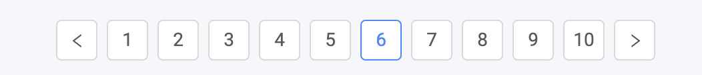

# react-infinite-pagination

[](https://www.npmjs.com/package/react-infinite-pagination)
[](https://www.npmjs.com/package/react-infinite-pagination)

> A React component to render a infinite pagination(without total page) just like google

By installing this component and using my `example.css` you can obtain this:



## Installation

```bash
yarn add react-infinite-pagination
```

## Usage[(Hooks only)](https://reactjs.org/docs/hooks-intro.html)

Example: https://codesandbox.io/s/wonderful-brown-gtdsp?fontsize=14

```js
import Pagination from 'react-infinite-pagination';
import 'react-infinite-pagination/example.css';

<Pagination current={6} />;
```

## Props

| Name             | Type                            | Description                                                              |
| ---------------- | ------------------------------- | ------------------------------------------------------------------------ |
| pageInVisible    | Number                          | The number of pages to display. Default: `10`                            |
| current          | Number                          | The current page selected. Default: `1`                                  |
| lastPage         | Number                          | The total number of pages. If `undefined` the pagination will infinite   |
| hideOnSinglePage | Boolean                         | Whether to hide pager on single page                                     |
| wrapClassName    | String                          | The class name of the container of the pagination. Default: `pagination` |
| itemClassName    | String                          | The class name of the page item. Default: `pagination-item`              |
| onChange         | Function (page) => {}           | The callback function whether page change                                |
| renderPageItem   | ({children, page}) => ReactNode | The component to render the page item. Don't use it                      |
| renderPrev       | ({page}) => ReactNode           | The component to render the previous button                              |
| renderNext       | ({page}) => ReactNode           | The component to render the previous button                              |

## License

MIT © [Nghiep](https://nghiepit.dev)
